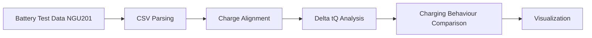

# Battery Charging Analysis

Python tools for analysing lithium-ion battery charging experiments.

This repository contains scripts and documentation for analysing battery charging behaviour using experimental data exported from NGU201.

---

# Project Overview

The goal of this repository is to provide a structured workflow for analysing lithium-ion battery charging experiments.

The analysis focuses on comparing charging behaviour using **Δt(Q)** curves.

Key objectives:

- analyse battery charging data
- compare charging conditions
- evaluate state-equivalent charging time
- generate reproducible research plots

---

# Analysis Workflow



---

# Repository Structure

```
battery-charging-analysis/
│
├── scripts/
│   └── plot_delta_tq.py
│
├── docs/
│   └── method_notes.md
│
├── data/
│   ├── raw/
│   └── processed/
│
├── results/
│   ├── figures/
│   └── tables/
│
├── README.md
├── requirements.txt
├── .gitignore
└── LICENSE
```

---

# Script

### plot_delta_tq.py

Research-oriented analysis script for Δt(Q) comparison of lithium-ion battery charging experiments.

Main functions:

- read NGU201 CSV files
- identify DC reference condition
- compute Δt(Q)
- calculate AΔt up to SOC = 80%
- generate comparison plots

---

# Installation

Install required Python packages:

```bash
pip install -r requirements.txt
```

---

# Usage

Place CSV files in the same directory as the script or specify them manually.

Run the script:

```bash
python scripts/plot_delta_tq.py
```

Generated figures will be saved in:

```
results/figures/
```

---

# Author

Jiaxing Lu

Research on lithium-ion battery charging behaviour and experimental data analysis.
