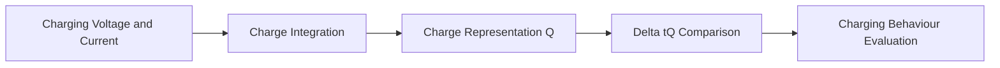
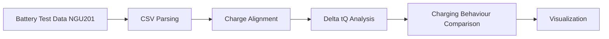

# Battery Charging Analysis


Python tools for analysing lithium-ion battery charging experiments using the **Δt(Q)** methodology.

This repository provides scripts and documentation for analysing battery charging behaviour using experimental data exported from **Rohde & Schwarz NGU201** battery testing systems.

---

## Overview

This project provides a structured analysis workflow for lithium-ion battery charging experiments.

The repository focuses on analysing charging behaviour using the **Δt(Q)** method, which compares the time required to reach the same transferred charge under different charging conditions.

The repository contains:

- research-oriented analysis scripts
- methodological documentation
- a reproducible data analysis workflow

The project is intended as a research prototype supporting experimental battery analysis.

---

## Research Goal

The goal of this project is to analyse lithium-ion battery charging behaviour using **state-equivalent criteria** rather than simple voltage-based comparisons.

The analysis focuses on the **Δt(Q) method**, which compares the time required to reach the same transferred charge under different charging conditions.

This approach enables a consistent comparison of charging behaviour in experimental battery studies.

---

## Concept

The core idea of this analysis is to compare charging behaviour using **state-equivalent charge criteria**.

Instead of comparing charging curves by voltage thresholds, charging processes are aligned by transferred charge **Q(t)** and compared using **Δt(Q)**.



---

## Analysis Workflow



---

## Methodological Background

Traditional charging comparisons often rely on voltage thresholds such as the time required to reach a specific voltage.

In this project, charging behaviour is analysed using **state-equivalent charge criteria**.

The Δt(Q) method compares charging curves by analysing the time difference required to reach identical transferred charge values.

More details can be found in:

```
docs/method_notes.md
```

---

## Repository Structure

```
battery-charging-analysis/
│
├── scripts/
│   └── plot_delta_tq.py
│
├── docs/
│   └── method_notes.md
│
├── data/
│   ├── raw/
│   └── processed/
│
├── results/
│   ├── figures/
│   └── tables/
│
├── README.md
├── requirements.txt
├── .gitignore
└── LICENSE
```

---

## Script

### `plot_delta_tq.py`

Research-oriented analysis script for Δt(Q) comparison of lithium-ion battery charging experiments.

Main functionality:

- read NGU201 CSV files
- automatically identify DC reference condition
- compute Δt(Q) curves
- compute AΔt up to SOC = 80%
- generate comparison plots

---

## Requirements

Python environment recommended:

```
Python ≥ 3.9
numpy
pandas
matplotlib
```

Install dependencies:

```bash
pip install -r requirements.txt
```

---

## Installation

Clone the repository:

```bash
git clone https://github.com/YusoXXX/battery-charging-analysis.git
cd battery-charging-analysis
```

Install dependencies:

```bash
pip install -r requirements.txt
```

---

## Usage

Place CSV files in the same directory as the script or specify them manually.

Run:

```bash
python scripts/plot_delta_tq.py
```

Generated figures will be saved in:

```
results/figures/
```

---

## Research Notice

This repository contains analysis scripts and workflow developed as part of ongoing research on lithium-ion battery charging behaviour.

The repository is intended to provide transparency of the analysis methodology and reproducibility of the computational workflow.

Experimental datasets and key research results are intentionally not included in the public repository in order to protect ongoing research work.

If you intend to reuse the analysis workflow or code in academic publications, please cite this repository and contact the author when appropriate.

---

## Data Availability

Example experimental results are not included in the public repository in order to protect ongoing research work.

Experimental datasets will be made available upon publication of the related research work.

---

## Status

This repository is under active development and currently focuses on lithium-ion battery charging experiment analysis.

Future extensions may include:

- automated CSV parsing improvements
- additional charging comparison metrics
- extended parameter extraction tools

---

## Citation

If you use this code or analysis workflow in academic work, please cite:

```
Lu, Jiaxing.
Battery Charging Analysis.
GitHub repository.
```

BibTeX example:

```
@software{lu_battery_charging_analysis,
  author = {Lu, Jiaxing},
  title = {Battery Charging Analysis},
  year = {2026},
  url = {https://github.com/jiaxingLu/battery-charging-analysis}
}
```

A DOI may be provided in the future when the repository is archived for publication.

---

## License

This project is released under the MIT License.

See the `LICENSE` file for details.

---

## Author

Jiaxing Lu  
Research on lithium-ion battery charging behaviour and experimental data analysis.
