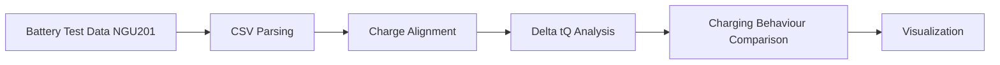

# Battery Charging Analysis


Python tools for analysing lithium-ion battery charging experiments using the **Δt(Q)** methodology.

This repository provides scripts and documentation for analysing battery charging behaviour using experimental data exported from **Rohde & Schwarz NGU201** battery testing systems.

---

## Research Goal

The goal of this project is to analyse lithium-ion battery charging behaviour using **state-equivalent criteria** rather than simple voltage-based comparisons.

The analysis focuses on the **Δt(Q) method**, which compares the time required to reach the same transferred charge under different charging conditions.

This approach enables a consistent comparison of charging behaviour in experimental battery studies.

---

## Concept

The core idea of this analysis is to compare charging behaviour using **state-equivalent charge criteria**.

Instead of comparing charging curves by voltage thresholds, charging processes are aligned by transferred charge **Q(t)** and compared using **Δt(Q)**.

```mermaid
flowchart LR
    A[Charging Voltage / Current] --> B[Charge Integration]
    B --> C[Q(t) Representation]
    C --> D[Delta tQ Comparison]
    D --> E[Charging Behaviour Evaluation]
```
---


## Analysis Workflow



---

## Methodological Background

Traditional charging comparisons often rely on voltage thresholds such as the time required to reach a specific voltage.

In this project, charging behaviour is analysed using **state-equivalent charge criteria**.

The Δt(Q) method compares charging curves by analysing the time difference required to reach identical transferred charge values.

More details can be found in:

```
docs/method_notes.md
```

---

## Repository Structure

```
battery-charging-analysis/
│
├── scripts/
│   └── plot_delta_tq.py
│
├── docs/
│   └── method_notes.md
│
├── data/
│   ├── raw/
│   └── processed/
│
├── results/
│   ├── figures/
│   └── tables/
│
├── README.md
├── requirements.txt
├── .gitignore
└── LICENSE
```

---

## Script

### `plot_delta_tq.py`

Research-oriented analysis script for Δt(Q) comparison of lithium-ion battery charging experiments.

Main functionality:

- read NGU201 CSV files
- automatically identify DC reference condition
- compute Δt(Q) curves
- compute AΔt up to SOC = 80%
- generate comparison plots

---

## Installation

Install required Python packages:

```bash
pip install -r requirements.txt
```

---

## Usage

Place CSV files in the same directory as the script or specify them manually.

Run:

```bash
python scripts/plot_delta_tq.py
```

Generated figures will be saved in:

```
results/figures/
```

---

## Data Availability

Example experimental results are not included in the public repository in order to protect ongoing research work.

Experimental datasets will be made available upon publication of the related research work.

---

## Status

This repository is under active development and currently focuses on lithium-ion battery charging experiment analysis.

Future extensions may include:

- automated CSV parsing improvements
- additional charging comparison metrics
- extended parameter extraction tools

---

## Author

Jiaxing Lu  
Research on lithium-ion battery charging behaviour and experimental data analysis.
